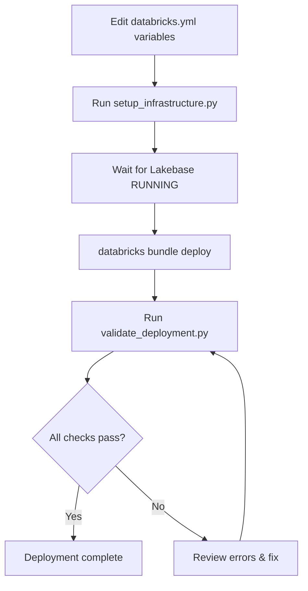

# Setup and Validation Scripts

Customer-agnostic deployment scripts for the CS Receipt Lookup Platform.

## Overview

These scripts help automate infrastructure setup and deployment validation for new customer deployments. Use these **in addition to** the main DAB deployment workflow.

## Prerequisites

1. **Databricks CLI** configured with workspace authentication
2. **Python 3.11+** with required packages:
   ```bash
   pip install databricks-sdk 'psycopg[binary]'
   ```
3. **Workspace Admin** permissions (for Lakebase and Unity Catalog operations)
4. **Environment variables** set in `databricks.yml` or shell

## Script Execution Order

### Full Deployment Workflow

```bash
# 1. Configure your deployment (edit databricks.yml variables)
#    Set: customer_display_name, catalog_name, lakebase_instance_name, etc.

# 2. Run infrastructure setup (creates Lakebase + Unity Catalog)
python3 scripts/setup_infrastructure.py

# 3. Deploy DAB resources (pipelines, jobs, app)
databricks bundle deploy

# 4. Validate deployment
python3 scripts/validate_deployment.py

# 5. (Optional) Seed test data for POC/demo
#    Use the existing generate_test_data.py script
```

## Script Descriptions

### 1. `setup_infrastructure.py`

**Purpose**: Creates all required infrastructure before DAB deployment.

**What it creates**:
- ✅ Lakebase Provisioned instance (CU_2 capacity by default)
- ✅ Unity Catalog with bronze/silver/gold schemas
- ✅ Unity Catalog volumes for raw data and exports
- ✅ Lakebase native tables (audit_log, receipt_delivery_log, etc.)
- ✅ Lakebase AI tables (product_embeddings with pgvector)
- ✅ Initial RBAC grants for cs_rep, supervisor, fraud_team groups

**What it does NOT create**:
- ❌ DLT pipelines (created by DAB deployment)
- ❌ Databricks Workflows/Jobs (created by DAB deployment)
- ❌ Databricks App (created by DAB deployment)
- ❌ Test data (use generate_test_data.py separately)

**Usage**:

```bash
# Option 1: Use environment variables (recommended)
export CUSTOMER_DISPLAY_NAME="Acme Retail"
export CATALOG_NAME="acme_retail"
export LAKEBASE_INSTANCE_NAME="acme-receipt-db"
python3 scripts/setup_infrastructure.py

# Option 2: Pass arguments explicitly
python3 scripts/setup_infrastructure.py \
    --customer-name "Acme Retail" \
    --catalog-name "acme_retail" \
    --lakebase-instance "acme-receipt-db" \
    --lakebase-capacity "CU_2"
```

**Expected output**:
```
=== Step 1: Creating Lakebase Instance ===
✓ Lakebase instance created: acme-receipt-db
  State: CREATING
  Capacity: CU_2

=== Step 2: Creating Unity Catalog ===
✓ Catalog created: acme_retail
✓ Schema created: acme_retail.bronze
✓ Schema created: acme_retail.silver
✓ Schema created: acme_retail.gold

=== Step 3: Waiting for Lakebase Instance ===
✓ Lakebase instance is RUNNING
  Host: instance-abc123.database.azuredatabricks.net

=== Step 4: Creating Lakebase Tables ===
  Creating table: audit_log
  Creating table: receipt_delivery_log
  Creating table: agent_state
  Creating table: search_cache
  Creating table: product_embeddings
  Creating HNSW index on product_embeddings...
✓ Created 5 Lakebase tables

=== Infrastructure Setup Complete ===
```

**Typical runtime**: 10-15 minutes (most time spent waiting for Lakebase to provision)

**Idempotency**: Safe to re-run. Skips resources that already exist.

---

### 2. `validate_deployment.py`

**Purpose**: Validates that deployment is healthy and all components are accessible.

**What it validates**:
1. ✓ Lakebase instance exists and is RUNNING
2. ✓ Unity Catalog exists
3. ✓ Schemas exist (bronze, silver, gold)
4. ✓ Volumes exist (raw_data, exports)
5. ✓ Lakebase connectivity (can connect and query)
6. ✓ Lakebase tables exist (native, AI tables)
7. ✓ DLT pipeline is deployed
8. ✓ Databricks App is deployed

**Usage**:

```bash
# Option 1: Use environment variables (recommended)
export CUSTOMER_DISPLAY_NAME="Acme Retail"
export CATALOG_NAME="acme_retail"
export LAKEBASE_INSTANCE_NAME="acme-receipt-db"
python3 scripts/validate_deployment.py

# Option 2: Pass arguments explicitly
python3 scripts/validate_deployment.py \
    --customer-name "Acme Retail" \
    --catalog-name "acme_retail" \
    --lakebase-instance "acme-receipt-db"
```

**Expected output**:
```
================================================================================
CS Receipt Lookup Platform — Deployment Validation
Customer: Acme Retail
Catalog: acme_retail
Lakebase: acme-receipt-db
================================================================================

1. Validating Lakebase instance...
  ✓ Instance 'acme-receipt-db' is RUNNING
    Host: instance-abc123.database.azuredatabricks.net

2. Validating Unity Catalog...
  ✓ Catalog 'acme_retail' exists

3. Validating schemas...
  ✓ Schema 'acme_retail.bronze' exists
  ✓ Schema 'acme_retail.silver' exists
  ✓ Schema 'acme_retail.gold' exists

4. Validating volumes...
  ✓ Volume 'acme_retail.bronze.raw_data' exists
  ✓ Volume 'acme_retail.gold.exports' exists

5. Validating Lakebase connectivity...
  ✓ Successfully generated database credential
    Token length: 1234 characters
  ✓ Successfully connected to Lakebase
    PostgreSQL version: PostgreSQL 16.1 on x86_64-pc-linux-gnu...

6. Validating Lakebase tables...
  ✓ Table 'audit_log' exists (0 rows)
  ✓ Table 'receipt_delivery_log' exists (0 rows)
  ✓ Table 'agent_state' exists (0 rows)
  ✓ Table 'search_cache' exists (0 rows)
  ✓ Table 'product_embeddings' exists (0 rows)

7. Validating DLT pipeline...
  ✓ DLT pipeline found: acme-retail-receipt-lookup-pipeline
    Pipeline ID: abc123...
    Latest update state: COMPLETED

8. Validating Databricks App...
  ✓ Databricks App found: acme-retail-cs-receipt-lookup
    App state: RUNNING
    Compute state: RUNNING
    URL: https://workspace.../apps/abc123

================================================================================
VALIDATION SUMMARY
================================================================================
✓ PASS - Lakebase Instance
✓ PASS - Unity Catalog
✓ PASS - Schemas
✓ PASS - Volumes
✓ PASS - Lakebase Connectivity
✓ PASS - Lakebase Tables
✓ PASS - Dlt Pipeline
✓ PASS - App Deployment

✓ All validations passed - deployment is healthy
```

**Exit codes**:
- `0` - All validations passed
- `1` - One or more validations failed
- `2` - Configuration error or validation could not run

**Typical runtime**: 1-2 minutes

---

### 3. `generate_test_data.py` (Existing Script)

**Purpose**: Generates sample receipt data for POC, demos, or testing.

**Usage**: See existing documentation in that script.

**When to use**: After infrastructure setup and DAB deployment are complete, if you need sample data for demonstrations.

---

## Troubleshooting

### "Lakebase instance creation failed"

**Cause**: Workspace may not have Lakebase enabled, or quota limits reached.

**Fix**:
1. Verify Lakebase is enabled in your workspace (requires E2 tier or higher)
2. Check workspace quota for Lakebase instances
3. Try reducing capacity: `--lakebase-capacity CU_1`

### "psycopg not installed"

**Cause**: Python package missing for Lakebase connectivity validation.

**Fix**:
```bash
pip install 'psycopg[binary]'
```

### "Permission denied" errors during setup

**Cause**: Insufficient Databricks permissions.

**Fix**:
- Ensure you have **Workspace Admin** role
- For Unity Catalog operations, ensure you're a **metastore admin** or have been granted **CREATE CATALOG** privilege
- For Lakebase operations, ensure your workspace has Lakebase enabled

### "Catalog already exists" (harmless warning)

**Cause**: Re-running setup script after partial completion.

**Fix**: This is expected and harmless. The script is idempotent and will skip existing resources.

### Validation fails on "DLT pipeline" or "Databricks App"

**Cause**: These are created by DAB deployment, not the setup script.

**Fix**:
1. Run `databricks bundle deploy` if you haven't already
2. Wait for pipelines/apps to finish deploying (can take 5-10 minutes)
3. Re-run validation

---

## Environment Variables Reference

All scripts read from these environment variables (can also be passed as CLI arguments):

| Variable | Description | Example |
|----------|-------------|---------|
| `CUSTOMER_DISPLAY_NAME` | Human-readable customer name | `"Acme Retail"` |
| `CATALOG_NAME` | Unity Catalog name (lowercase, underscores) | `"acme_retail"` |
| `LAKEBASE_INSTANCE_NAME` | Lakebase instance identifier (lowercase, hyphens) | `"acme-receipt-db"` |
| `LAKEBASE_CAPACITY` | Compute capacity (optional) | `"CU_2"` (default) |

These should match the variables defined in your `databricks.yml` file.

---

## Integration with DABs

These scripts are designed to work **alongside** DAB deployment:

### Deployment Workflow



### Why separate infrastructure setup?

1. **Lakebase provisioning takes 5-10 minutes** - better to do this upfront rather than wait during DAB deployment
2. **Unity Catalog setup is idempotent** - safe to create before DABs reference these resources
3. **Lakebase tables have dependencies** - easier to handle schema creation separately from data pipelines
4. **Validation as a separate step** - allows testing deployment health without re-deploying

---

## Best Practices

1. **Always run validation after deployment**
   ```bash
   databricks bundle deploy && python3 scripts/validate_deployment.py
   ```

2. **Set environment variables in your CI/CD pipeline**
   ```yaml
   # GitHub Actions example
   env:
     CUSTOMER_DISPLAY_NAME: "Acme Retail"
     CATALOG_NAME: "acme_retail"
     LAKEBASE_INSTANCE_NAME: "acme-receipt-db"
   ```

3. **Use setup script for initial deployment only**
   - Run once per customer deployment
   - Re-run only if you need to recreate infrastructure
   - For updates, use `databricks bundle deploy` directly

4. **Check validation output for warnings**
   - `✓ PASS` = healthy
   - `⚠ WARNING` = might be okay (e.g., no test data yet)
   - `✗ FAIL` = needs attention

---

## Next Steps After Successful Deployment

1. **Configure RBAC Groups**
   - Create `cs_rep`, `supervisor`, `fraud_team` groups in Databricks Account Console
   - Add users to appropriate groups

2. **Run DLT Pipeline**
   ```bash
   databricks pipelines run --pipeline-id <pipeline-id>
   ```

3. **Run Embedding Job** (for semantic search)
   ```bash
   databricks jobs run --job-id <embedding-job-id>
   ```

4. **Access the App**
   - Navigate to the Databricks App URL from validation output
   - Test receipt lookup, search, and CS context features

5. **Monitor via Audit Logs**
   ```sql
   -- Query audit log in Lakebase
   SELECT * FROM audit_log ORDER BY created_at DESC LIMIT 100;
   ```

---

## Support

For issues or questions:
1. Review DEPLOYMENT.md in the root directory
2. Check validation output for specific error messages
3. Ensure all prerequisites are met (permissions, packages, etc.)
4. Verify `databricks.yml` variables match your environment
